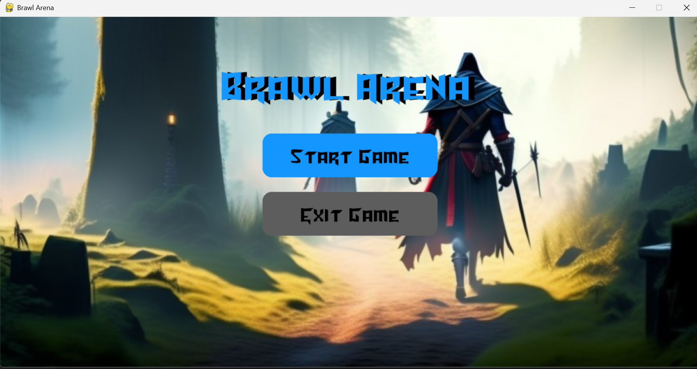
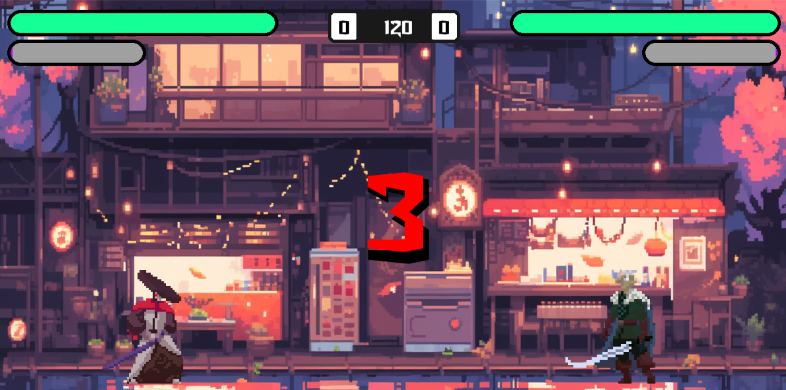
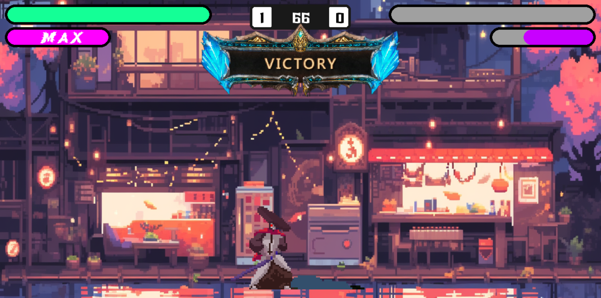
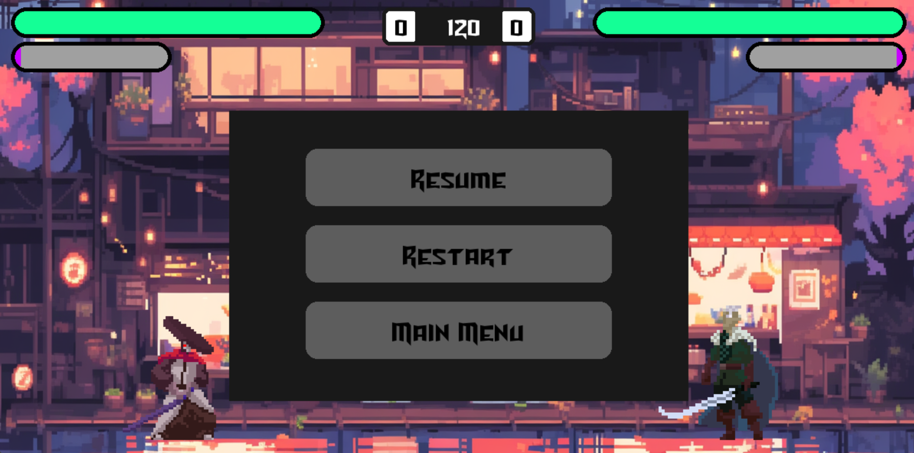
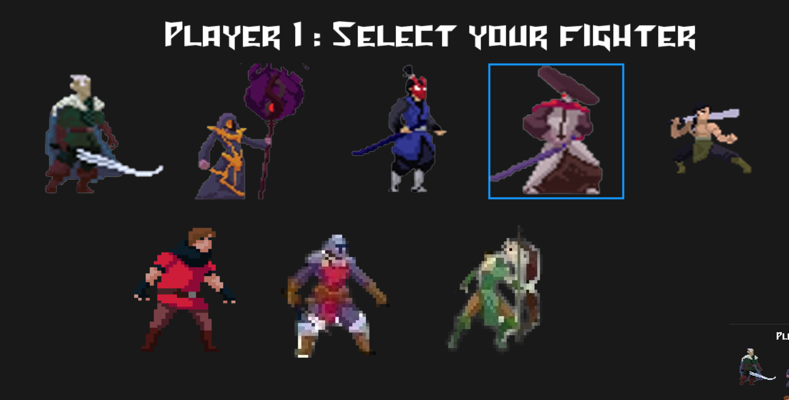
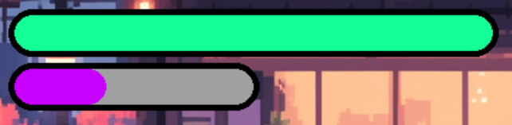
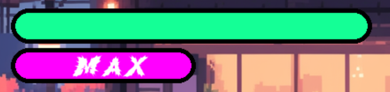

# Brawl Arena


**Brawl Arena** is a fast-paced 2D local multiplayer fighting game (1v1). Developed in Python with Pygame, it features a complete combat system with mana management, unique characters, and random arenas.

> [!NOTE] 
> This game was created as a 2nd-year preparatory class project at [Polytech Dijon](https://polytech.ube.fr) **PeiP (2023-2024)**.



## Table of Contents
1. [Features](#features)
2. [Game Overview](#game-overview)
3. [Characters](#characters)
4. [Mana System](#mana-system)
5. [Controls](#controls)
6. [Installation](#installation)
7. [Code Architecture](#code-architecture)
8. [Credits & License](#credits--license)

## Features

- **Local Multiplayer:** 1v1 Duel on the same keyboard.
- **8 Fighters:** A variety of characters with unique visual styles.
- **Combat System:**
    - **Variety of moves:** Each character has 2 different attack animations (some have 3).
    - **Precise Hitboxes:** Management of hit zones to validate damage.
    - **Gravity:** Realistic jumping and falling physics.
- **Game Mechanics:**
    - Passive and active Mana regeneration.
    - Activatable "Boost" mode to double damage.
- **Random Arenas:** The background changes among 6 environments at each game launch.

## Game Overview

### Combat
The game includes a countdown and a 120-second timer per round.



### Victory
The first to deplete the opponent's health bar wins the round. If neither fighter dies, the one with the most health wins.



### Pause Menu
Need a break? The menu allows you to resume, restart, or quit the game at any time.



## Characters

A selection screen allows you to choose your avatar. Although base damage is identical, the playstyle differs depending on the class:



- **Melee:** The majority of fighters (Samurai, Knight, Wizard...) must get close to hit. Their attack animations have varied speeds.
- **Ranged:** The **Huntress** possesses a unique mechanic: she fires projectiles across the screen, ideal for keeping the opponent at a distance.

## Mana System

Mana management is strategic and rewards aggressiveness while offering passive income:

1.  **Accumulation:** The purple gauge fills gradually over time, and gains a significant bonus with each hit on the opponent.

    

2.  **Activation :** Once the gauge is maxed out, it changes color. You can then activate a Boost that doubles your damage on the next attack !

    

## Controls

The game is played by two players on the same keyboard.

| Action | Player 1 (Left) | Player 2 (Right) |
| :--- | :---: | :---: |
| **Movement** | <kbd>Q</kbd> (Left) / <kbd>D</kbd> (Right) | <kbd>←</kbd> / <kbd>→</kbd> |
| **Jump** | <kbd>Z</kbd> | <kbd>↑</kbd> |
| **Attack 1** | <kbd>E</kbd> | <kbd>M</kbd> |
| **Attack 2** | <kbd>A</kbd> | <kbd>L</kbd> |
| **Attack 3 (if available)** | <kbd>R</kbd> | <kbd>P</kbd> |
| **Activate Boost (Mana)**| <kbd>T</kbd> | <kbd>O</kbd> |
| **Menu / Pause** | <kbd>Esc</kbd> | <kbd>Esc</kbd> |

> ![NOTE]
> Player 1 controls are optimized for an AZERTY keyboard layout.

## Installation

### Prerequisites
- [Python 3.x](https://www.python.org/) must be installed on your machine.
- The `pip` package manager.

### Steps

1.  **Download the project:**
    - Download the project archive (**Code > Download ZIP** button on GitHub).
    - Extract the files to a folder on your machine.

2.  **Install dependencies:**

    This project relies on the [Pygame](https://www.pygame.org/docs/) library.
    ```bash
    pip install pygame
    ```

3.  **Launch the game:**
    ```bash
    python main.py
    ```

## Code Architecture

This project uses an Object-Oriented structure to manage game entities. 

[Image of class diagram showing attributes and methods]


- **`main.py`**: Game entry point. Manages the main loop, different states (Menu, Combat, Pause), and global display.
- **`fighter.py`**: Defines the parent class `Fighter`. Manages physics, movement, and melee combat logic.
- **`RangedFighter.py`**: Inherits from the `Fighter` class. Adds specific functionality for ranged fighters (projectile creation and management).
- **`Selectplayer.py`**: Manages character selection screen logic and instantiation of the correct object (Fighter or Ranged) based on player choice.
- **`FighterData.py`**: Data file that centralizes spritesheet loading, animations, and adjustment variables (size, scale, offsets) for each character.
- **`button.py`**: Utility class for creating and managing interactive buttons (hover, clicks) used in menus.

## Credits & License

This project was created for **educational and non-profit purposes**. It is not intended for commercialization.

- **Code & Development:** [Nicolas Defour](https://github.com/Craftsman0001) & [Leopold Saublet](https://github.com/lele9627)
- **Technical Base:** Initially inspired by the tutorial from [Coding With Russ](https://youtu.be/s5bd9KMSSW4), the code was enriched to integrate an object-oriented architecture, centralized data management, as well as mana and menu mechanics.
- **Graphics Assets:** Retrieved for free from [itch.io](https://itch.io/). All rights belong to their respective creators. These assets are available for free on the platform.
- **Music:** Audio tracks used for ambiance purposes for this academic project. No rights held.